# Face Balance — AI 협업 개발 포트폴리오

> **"얼굴 좌우 균형을 실시간으로 측정하고 셀프 트레이닝하는 iOS 앱"**  
> 기획부터 실기기 빌드까지 하루 안에 완성한 1인 AI 협업 프로젝트

---

## 프로젝트 개요

| 항목 | 내용 |
|------|------|
| 앱 이름 | Face Balance |
| 플랫폼 | iOS (React Native / Expo SDK 54) |
| 핵심 기능 | MediaPipe Face Mesh 478점 실시간 얼굴 대칭 측정 |
| 개발 기간 | 1일 (Claude와 단일 세션) |
| 결과 | 실기기 빌드 성공, 실제 동작 확인 |

---

## 진행 과정 한눈에 보기

### STEP 1 — MVP 기본 카메라 화면

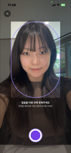

> 첫 번째 버전. 전면 카메라 + 보라색 타원 가이드 프레임. 얼굴 인식 없음.  
> **프롬프트:** "전면 카메라로 얼굴 찍고 분석 결과 보여주는 앱 만들어줘"

---

### STEP 2 — MediaPipe 연결 시도 → 오류 3종 격파

**오류 1. getUserMedia 미정의**

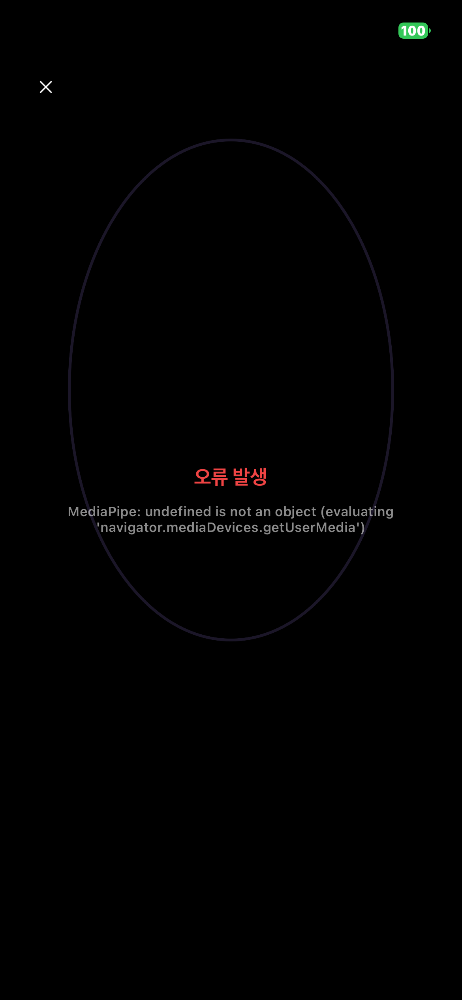

> WebView에서 카메라 접근 불가. `about:blank`는 insecure context라 차단됨.  
> **해결:** `baseUrl: 'http://localhost/'` 추가  
> **프롬프트:** 에러 스크린샷 첨부 → "당장 해결해"

---

**오류 2. FileSystem 모듈 없음**

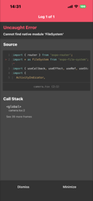

> `expo-file-system` 버전 충돌 (SDK 54에 맞지 않는 v56 설치됨).  
> **해결:** `npx expo install expo-file-system` → `~19.0.23` 고정  
> **프롬프트:** 에러 스크린샷 첨부 → "이것도 해결해"

---

**오류 3. UTF8 undefined**

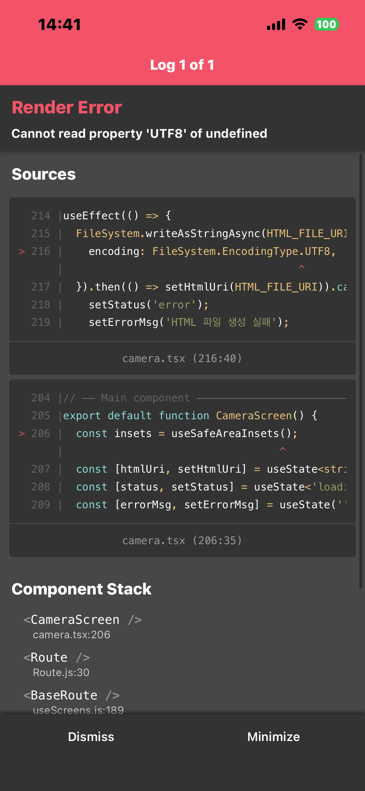

> `FileSystem.EncodingType.UTF8` 이 해당 버전에서 undefined.  
> **해결:** encoding 옵션 제거 (기본값이 UTF8이라 불필요)  
> **프롬프트:** "작동이 안돼 문제 당장 해결해. 말 짧게하고."

---

### STEP 3 — MediaPipe 연결 성공, 그러나 얼굴 왜곡

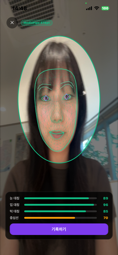

> 478개 랜드마크 매핑 성공했지만 얼굴이 길쭉하게 왜곡됨.  
> 원인: 640×480 가로 영상을 세로 화면에 비율 무시하고 강제 확대.  
> **프롬프트:** "매핑은 완벽해. 근데 얼굴이 왜 길쭉해졌니"  
> *(기능은 칭찬 → 문제만 정확히 지목 → 불필요한 재작업 방지)*

---

### STEP 4 — Cover 모드 적용, 정상 매핑

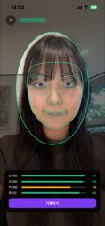

> Cover 모드 수식으로 비율 보정 + 랜드마크 좌표도 동일 변환 적용.  
> 얼굴 윤곽선, 눈썹, 눈, 홍채, 입술 478점 정밀 매핑 완성.

---

### STEP 5 — UI 고도화: 미러 모드 + 원형 게이지

| 미러 모드 | 라인 모드 |
|-----------|-----------|
| 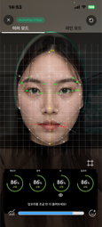 | 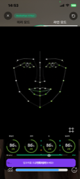 |

> 실시간 점수 게이지 4개 (중심선 / 윤곽 / 눈 / 입꼬리)  
> 배경 그리드 토글, 3D 스캔 빔 애니메이션 추가  
> **프롬프트:** 참고 이미지 첨부 + 항목별 상세 명세 전달

---

### STEP 6 — 최종 완성: Vignette + 입꼬리 대칭선 + 측정 포인트

| 미러 모드 (최종) | 라인 모드 (최종) |
|----------------|----------------|
| 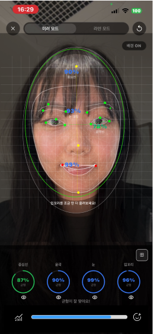 | 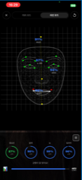 |

> - **Vignette:** 얼굴 타원 바깥 54% 어둡게 (ctx.ellipse hole 방식)  
> - **입꼬리 대칭선:** 좌/우 반쪽 독립 색상 (대칭=초록, 비대칭=주황)  
> - **10개 측정 포인트:** 점수 기반 파랑/초록/노랑/주황  
> - **플로팅 레이블:** 얼굴 랜드마크 위치에 실시간 점수 표시  
> - **저장 팝업:** "기록되었습니다" 토스트 (화면 이동 없음)

---

### STEP 7 — 스캔 UI 전면 개편: 와이어프레임 메쉬 + Surface Glow

> **목표:** 3D 스캐너 느낌의 몰입감 있는 스캔 UI 구현  
> **작업일:** 2026-05-30 18:00

**주요 변경사항:**

- **FACEMESH_TESSELATION 와이어프레임** — done phase에서만 478점 전체 메쉬 표시 (흰색 반투명)
- **Surface Following Scan Glow** — `scanFrac = y + z * 0.20`, `GWIN = 0.10`, 얼굴 굴곡을 따라 스캔 빔이 흐름
- **AlignFrame UI 개선** — idle / aligning 두 상태 모두 표시, 2초 카운트다운
- **프레임 이탈 UX** — 1초 경고 후 2초 자동 리셋
- **Full-screen Grid Overlay** — 38px 정사각형 셀, OX/OY 십자선 강조, 항상 표시
- **17개 키 랜드마크 점** — 항목별 색상 (눈/입/윤곽/중심선)
- **실시간 점수 동기화** — done phase에서 랜드마크 수신마다 WebView inject
- **이중 미러 버그 수정** — vx에서 미러 제거, 캔버스 플립만 유지

| 색상 기준 | 점수 |
|-----------|------|
| 초록 | ≥ 90 |
| 연두 | 80–89 |
| 노랑 | 70–79 |
| 주황 | 60–69 |
| 빨강 | < 60 |

> **프롬프트 전략:** "showMesh=isDone 조건 분리해줘" 처럼 변경 범위를 정확히 지정 → 기존 기능 건드리지 않고 신규 기능만 추가

---

### STEP 8 — 포트폴리오 자동화: GitHub + Notion 연동

> **작업일:** 2026-05-31 00:30

- **GitHub 레포 생성** (`ubin2914/face-balance`) — 소스코드 + 스크린샷 전체 push
- **Notion MCP 연결** — Claude Code와 Notion API 직접 연동 (`~/.claude/mcp.json`)
- **PORTFOLIO.md → Notion 자동 변환** — H1/H2/H3, 표, 이미지 블록, 구분선 완전 지원
- **업데이트 워크플로 확립** — 매 작업 세션 후 포폴 자동 갱신 체계 구축

---

### 참고 이미지 — 디자인 방향 설정에 사용

| 3D 스캔 UI 참고 | 랜드마크 구조 참고 |
|----------------|-----------------|
| 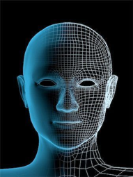 | 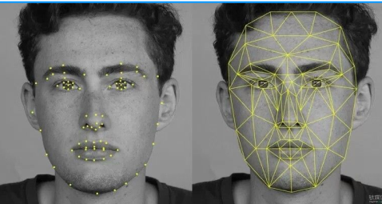 |

> 3D 렌더 느낌의 스캔 애니메이션과 얼굴 랜드마크 배치를 시각적으로 참고.  
> **프롬프트 전략:** 텍스트 설명 대신 이미지 첨부 → 구현 방향 오해 없이 1회 통과

---

## 핵심 기술 해결 요약

| 문제 | 원인 | 해결 |
|------|------|------|
| getUserMedia 미정의 | insecure context (about:blank) | `baseUrl: 'http://localhost/'` |
| 얼굴 길쭉하게 왜곡 | 비율 무시 강제 확대 | Cover 모드 + 랜드마크 좌표 변환 |
| Vignette가 반전됨 | scale(-1,1) winding order 역전 | ctx.restore() 이후 별도 처리 |
| 패키지 빌드 오류 | VisionCamera v3/v4 헤더 충돌 | 비호환 패키지 3개 제거 |

---

### STEP 9 — 앱 아이콘 교체

> **작업일:** 2026-05-31 02:00

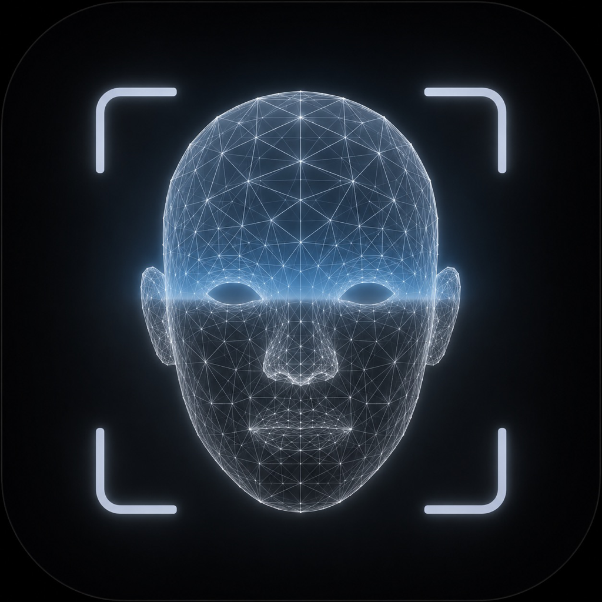

- 3D 와이어프레임 얼굴 + 스캔 브래킷 디자인으로 교체 (AI 생성 이미지)
- `assets/images/icon.png` 및 `ios/.../AppIcon.appiconset` 동시 교체
- iOS 알파 채널 제거 (JPEG 경유 변환) + 1024×1024 리사이즈
- iOS 아이콘 캐시 문제 해결 (앱 삭제 → Clean Build → 재설치)
- 기기별 카메라 줌 통일 버그 수정: `Math.max(W/vw, H/vh)` → `W/vw` (너비 기준 고정)

---

## 기술 스택

- **Expo SDK 54** / expo-router / TypeScript
- **React Native WebView** — MediaPipe를 WKWebView 내부에서 실행
- **MediaPipe Face Mesh 0.4** (478 랜드마크, CDN 로딩)
- **React Native Animated API** — 스캔 빔 / 저장 토스트 애니메이션
- **react-native-svg** — SVG 원형 게이지 / 하단 아이콘

---

## AI 협업 프롬프트 전략

| 상황 | 내가 쓴 방식 | 효과 |
|------|------------|------|
| 에러 발생 | 스크린샷 + "당장 해결해" | 원인 분석까지 자동 수행 |
| UI 수정 요청 | 참고 이미지 첨부 + 항목 명세 | 재수정 없이 1회 통과 |
| 기능 유지 요청 | "매핑은 그대로 유지해. 대신 ~" | 변경 범위 명확히 경계 |
| 작업 속도 조절 | "말 짧게, 토큰 아끼게" | 설명 최소화, 코드 바로 작성 |
| 기능 문의 | "MediaPipe에 직접 연결하는 방법은?" | 구체적 구현 방법 바로 제시 |

---

*개발: 콩유빈 / AI 협업: Claude Sonnet 4.6 (Anthropic)*
